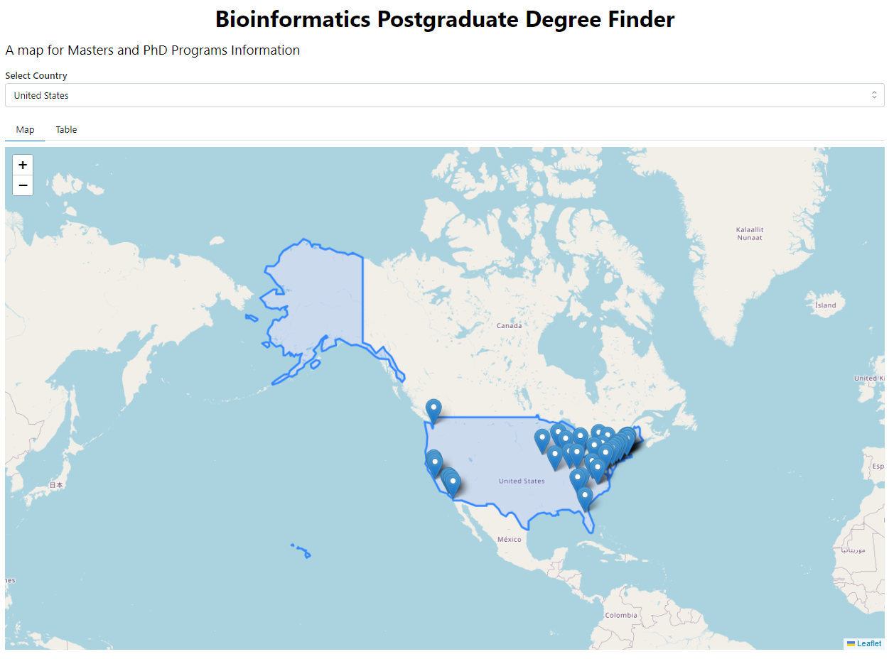
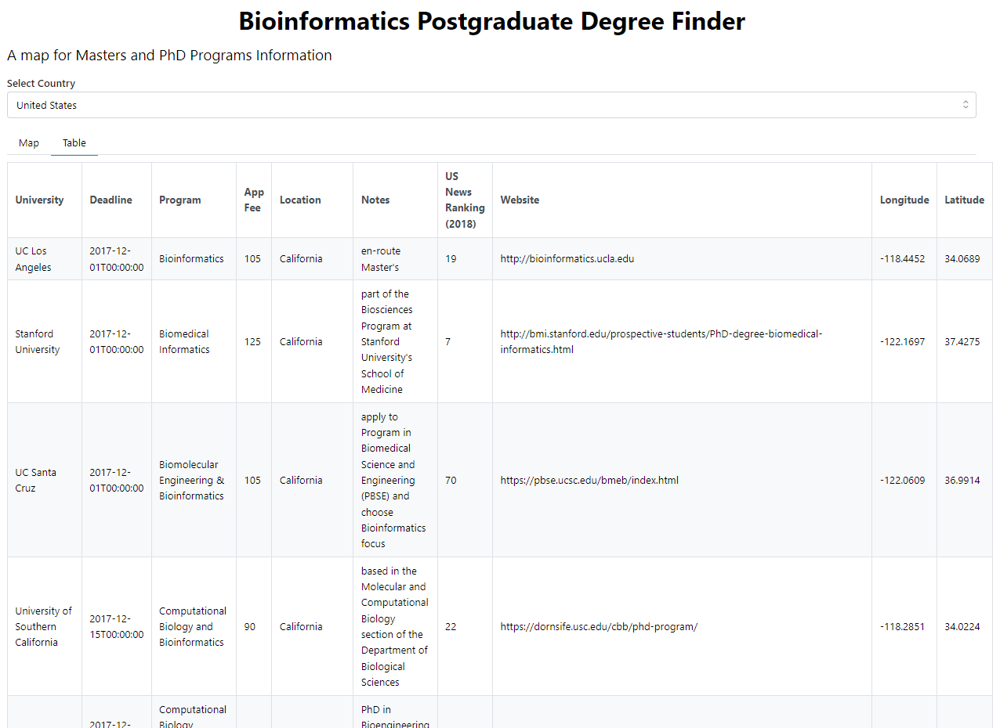

# Bioinfo Finder

Aplicacion web creada para mostrar programas de PhD sobre Bioinformatica ayudando en la busqueda y asistencia de informacion.

Este proyecto esta desarrollado con los paquetes de ***_Dash_*** y ***_Leaflet_*** para Python 3.12.2

## Instalacion

Clonacion del repositorio con:

`git clone https://github.com/Sociedad-Peruana-de-Bioinformatica/BioinfoFind.git`

Ingresar al folder principal del proyecto para los siguientes pasos.

### Creacion de Entorno Virtual (Opcional)

```
> python -m venv bioinfo-venv
> .\bioinfo-venv\Scripts\activate
```

### Ejecutar la aplicacion

Descargar las dependencias:

`pip install -r requirements.txt`

En la terminal escribir:

`python app.py`

la aplicacion se alojara en: [localhost:8050](http://localhost:8050/)

## Screenshots



